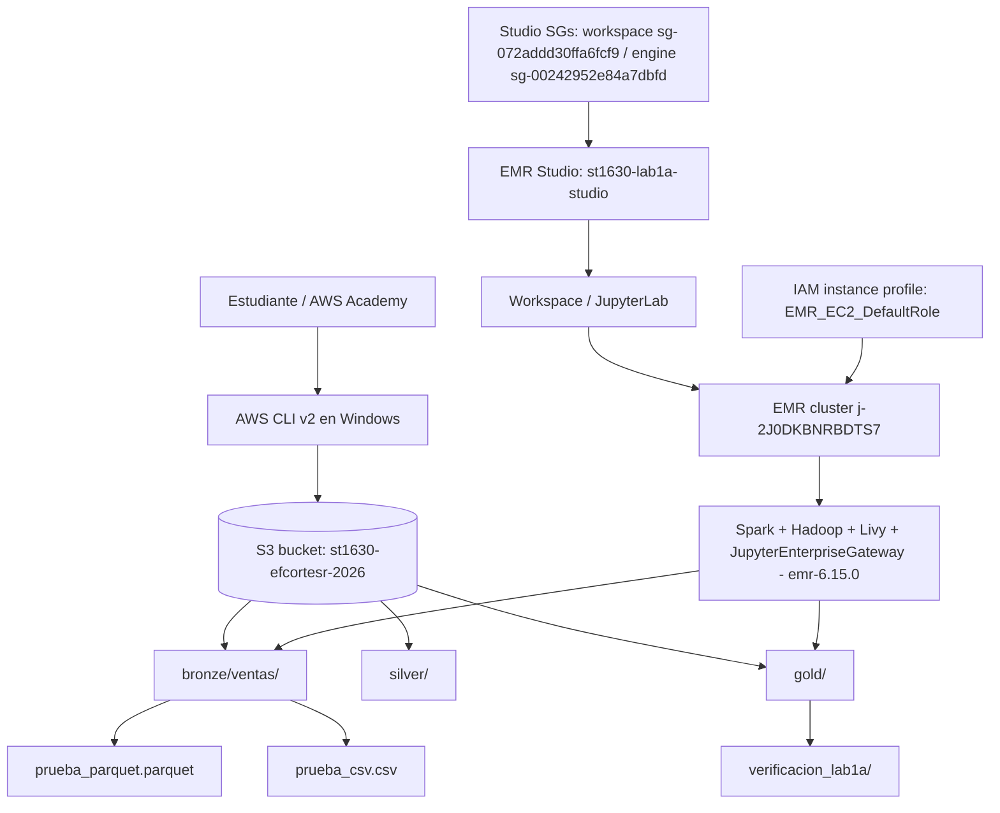

# Arquitectura - Lab 1a

**Curso:** ST1630-2026-2 - **Semana:** S4-S5 - **Fecha de entrega:** 2026-08-13  
**Estudiante:** Emmanuel Cortes, Mariana Sanchez, Juan Jose Osorio y Sara Hurtado

## 1. Diagrama de la arquitectura

## 2. Decisiones de S3

| Decisión               | Tu elección                                             | Justificación                                                                                                                                                                                                                                                 |
| ---------------------- | ------------------------------------------------------- | ------------------------------------------------------------------------------------------------------------------------------------------------------------------------------------------------------------------------------------------------------------- |
| Nombre del bucket      | st1630-efcortesr-2026                                   | El nombre sigue la convención del laboratorio st1630-{usuario}-{año} y agrega el usuario institucional para reducir el riesgo de colisión, ya que los nombres de buckets S3 son globales.                                                                     |
| Región                 | us-east-1                                               | Es la región indicada por el laboratorio y compatible con AWS Academy. Mantener S3, EMR y los logs en la misma región evita latencia y costos innecesarios de transferencia entre regiones.                                                                   |
| Estructura de prefijos | bronze/, silver/, gold/; datos crudos en bronze/ventas/ | La estructura separa datos crudos, datos limpios y datos agregados, siguiendo la arquitectura medallion vista en clase. En esta ejecución se cargaron prueba_parquet.parquet y prueba_csv.csv en Bronze, y la verificación Spark escribió resultados en Gold. |

**Justificación del particionamiento** (3-5 líneas):

> Usé una estructura simple bronze/silver/gold porque el dataset del lab es pequeño y el objetivo principal era validar la base del datalake, no optimizar particiones. Dentro de Bronze usé ventas/ para poder separar el dominio de datos y dejar espacio para nuevas fuentes en el futuro.

## 3. Decisiones de IAM

- ¿Qué permisos otorgaste al rol de EMR, exactamente?

  > Como AWS Academy devolvió no permitio la creación el rol, entonces para completar la verificación del lab se usó el instance profile preexistente EMR_EC2_DefaultRole, que ya estaba habilitado por el entorno Academy.

- ¿Qué permisos consideraste y descartaste? ¿Por qué?

  > Unicamente el uso de EMR_EC2_DefaultRole fue una adaptación por restricción del entorno, no lo que queriamos para esta arquitectura.

- ¿Por qué importa el mínimo privilegio específicamente en un sistema distribuido como este?

  > En un sistema distribuido, varios nodos ejecutan tareas en paralelo y cada nodo actúa con la autoridad del rol asociado al clúster. Si ese rol tiene permisos excesivos, un error en un job, una dependencia comprometida o una credencial temporal expuesta puede afectar más recursos que los necesarios. La relación con CAP está en la garantía que el sistema asume: así como un nodo que entrega datos inconsistentes rompe la confianza sobre el estado del sistema, un rol con permisos globales rompe la garantía de aislamiento entre recursos. Por eso el diseño correcto es limitar las acciones al bucket y a los objetos requeridos por el pipeline.

## 4. Decisiones de EMR

- Tipo de instancia elegido y justificación:

  > El clúster se creó con 2 nodos un nodo master y un nodo core. Esta configuración nos ayudo para poder ejecutar Spark en modo distribuido real, en lugar de simular todo en un solo proceso local.

- Configuración de Spark/aplicaciones instaladas:

  > Se usó Amazon EMR con aplicaciones Spark, Hadoop, Livy y JupyterEnterpriseGateway. Spark y Hadoop ejecutan el procesamiento distribuido; Livy y JupyterEnterpriseGateway fueron necesarios para que EMR Studio pudiera adjuntar el Workspace al clúster y ejecutar el notebook. Se instaló pandas y pyarrow. El clúster usó el bucket S3://st1630-efcortesr-2026 como ubicación de datos/logs y el instance profile EMR_EC2_DefaultRole por la restricción de permisos de AWS Academy.

- Configuración de EMR Studio y red:

  > El Studio st1630-lab1a-studio quedó asociado a la VPC vpc-0ed852807f190da19 y a la subnet subnet-06721feba7e3d2d7c, la misma subnet donde se creó el clúster final.

## 5. Estimación de costo

| Escenario                                                             | Costo estimado                                                                                                         |
| --------------------------------------------------------------------- | ---------------------------------------------------------------------------------------------------------------------- |
| Clúster encendido 24/7 durante un mes                                 | Aproximadamente 2 nodos _ 0.240 USD/h _ 730 h = 350.40 USD/mes. El valor aproximado para EC2 es cercana a 0.192 USD/h. |
| Clúster encendido solo durante las ~3 horas que lo usaste para el lab | Aproximadamente 2 nodos _ 0.240 USD/h _ 3 h = 1.44 USD                                                                 |

## 6. Reflexión - la era agéntica

> > La decisión en la que más dudamos fue cómo continuar el laboratorio cuando AWS Academy no permitió crear el rol IAM propio con mínimo privilegio. Consulté apoyo para saber cuales eran los errores asociados a AccessDenied, adaptar la ejecución a PowerShell a Linux y resolver la conexión entre EMR Studio, Jupyter y el clúster. A pesar de eso, consideramos la arquitectura y concluimos que la estructura Bronze/Silver/Gold era suficiente para este dataset pequeño y que el análisis de Spark debía hacerse sobre la ejecución real del notebook.

## 7. Bitácora de delegación

| Tarea                                                            | ¿Delegado a agente? | Justificación                                                                                                                                                                                          |
| ---------------------------------------------------------------- | ------------------- | ------------------------------------------------------------------------------------------------------------------------------------------------------------------------------------------------------ |
| Generar datos de prueba y adaptar ejecución a Windows/PowerShell | Sí                  | Se le pidio apoyo técnico porque el README estaba escrito para Bash y nuestro WSL no tenía una distribución instalada.                                                                                 |
| Troubleshooting de AWS CLI, S3, IAM, EMR y EMR Studio            | Sí                  | Se le pidio apoyo solucionando errores de CLI, especialmente NoCredentials o de roles, key pair inválido tras reiniciar AWS Academy y reglas de security groups necesarias para adjuntar el Workspace. |
| Crear bucket S3 y cargar datos de prueba                         | No                  | seguimos el paso a paso dado laboratorio.                                                                                                                                                              |
| Decidir permisos IAM ideales                                     | Parcuialmente       | La decisión es todo del laboratorio unicamente si salian errores de roles se pedia ayuda a chat.                                                                                                       |
| Interpretar resultados de Spark y DAG                            | No                  | La interpretación final la hicimos con la ejecución real del notebook en EMR Studio y en la captura del Spark UI.                                                                                      |
